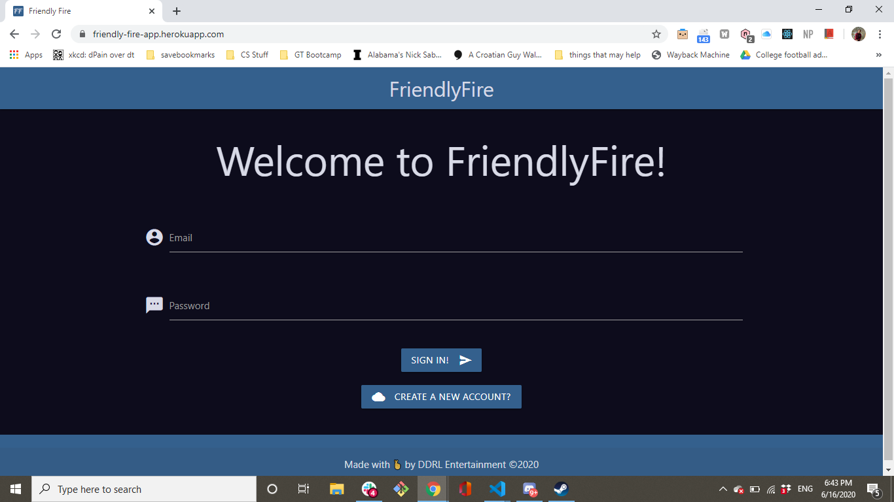
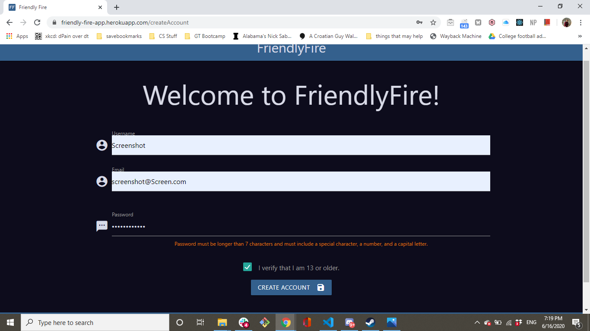
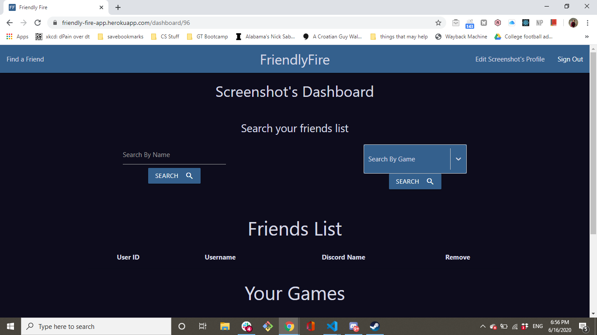
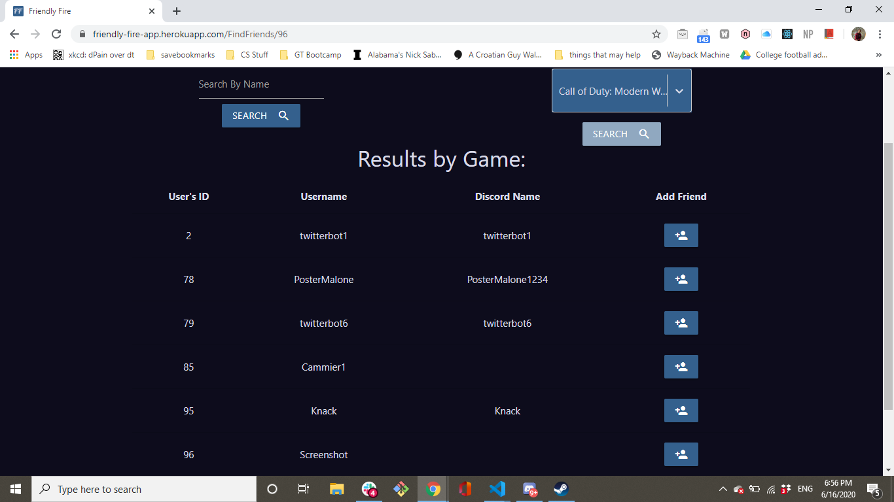
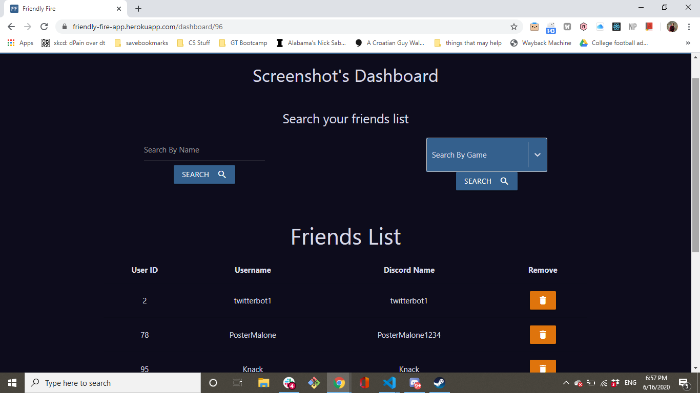

 ## Project Name:
 FriendOps

 ## Description:
 FriendOps is an application that allows gamers to connect with other gamers to find friends to play games with.  
 
 ## Table of Contents: 
 # Installation
 # Usage 
 # License 
 # Contributing Authors 
 # Tests 
 # Miscellaneous 

 ## Installation Instructions:
N/A, as this is a web application.
 ## Usage Instructions: 
 
 

 Upon navigating to the site, the user will first be prompted to either sign in or create an account.
 
 

  If the user creates an account, they will be directed to the "create account" page, where they will enter a username, an email address, and a password, with validation, to create their account. 
 
 

 Upon creating the account, the user will go to their account page, and be able to add games to their account and to add their discord name, as a method of communication with other users of our site.  

 

 Once the user clicks on the button to go to the dashboard, or if the user logins to an already extant account, they will be brought to the hub of our site, the dashboard. On the dashboard, the user will see a list of their friends, a list of the games associated with their account, and buttons to select users by game and by name. Of course, if the user has just started their account they won't have any friends associated with the account, so they will need to navigate to the find a friend page through the navbar. 

 Once at the Find a Friend Page, the user can search by either a user's unique name, or by one of the games the user owns. Upon finding a user through the above-mentioned criteria, the user can simply select the button next to a specific user to add the user to their friend list. 

 To navigate back to the dashboard, the user can either click on the back to the dashboard button or click on the FriendOps logo on the navbar. 

 Lastly, if for some reason the user wishes to delete their account, they can navigate to their edit profile page and click the delete button at the bottom. As this is irreversible, the user should be careful and only delete their account when they are absolutely sure. 

 ## License:
 MIT 

 ## Contributing Authors: 
 Ricardo Russ, Devin Carr, Landry Norman, David Rospond 

 ## Tests:
 N/A

 ## Bugs:
 At the moment, leaving the edit profile page without adding at least one game will cause the site to crash.

## Names used during development:
1. Project-placeholder
2. FriendlyFire
3. FriendOps

## Links to materials used for project development:
Trello: https://trello.com/b/ljSLzbUN/friendlyfire-workboard
PowerPoint: https://docs.google.com/presentation/d/1w9dekd8PZZKBeBqdXzgkokaEmJ606pXhq9IjBhY7pDY/edit#slide=id.g29f43f0a72_0_5
ERD:https://drive.google.com/file/d/1j10EXyTgz6wmjreoELJ3LGs9BAwBmkwY/view?usp=sharing
Wireframes:https://drive.google.com/file/d/1nEh0XuYA9dJ2dCCTcnJOf5K4kgvmmBMc/view?usp=sharing
 Badge:
 https://img.shields.io/badge/Maintained-Maintained-Green.svg)(https://shields.io/) 

